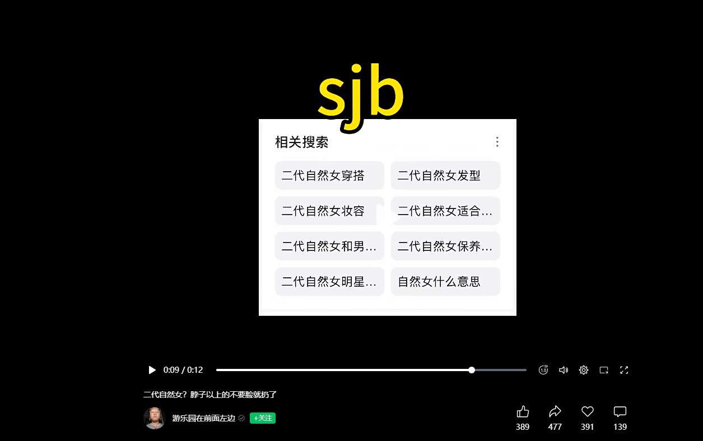

# 何为“自然女”，何为“对立”

==
**免责声明：**  
本文仅针对特定视频及发言文本进行逻辑与心理学层面的分析，所有批判均限于该发言者的言论表述，不涉及对任何性别群体整体创作能力的评价，亦不代表本人立场。分析过程仅作认知谬误的示范性拆解，不构成对任何人的人身攻击，也不鼓励任何形式的网络暴力或性别对立。读者请自行判断，理性讨论。==

## 前言

今天刷微信视频号，又刷到了她。

作者还是那个“游乐园在前面左边”（注释 1）。视频还是熟悉的配方：二极管、骂男性、骂评论。

真正让我停下来看的，不是她说了什么，而是一条**路人评论**。一个和她八竿子打不着的网友，只是被她的发言惊到了，随口问了一句“这是二代自然女吗”，就被她做成了新一期视频的素材。

所以这篇不聊立场，只聊逻辑。

## 一、一条路人评论，怎么就成了“破防现场”

先还原整个过程。

路人在评论区留了一句：**“我的妈呀，大姐，我的爸呀，大哥，这是二代自然女吗？”**，还顺手 @ 了几个人。

图 1：一句路人的疑问，成了后面两期视频的起点

她（注释 2）看到之后不乐意了，回了一句“二代自然女？”，然后把这条评论截图，发了一条新视频，前后问了两次“二代自然女是什么”。

图 2：把一句路人评论截图，做成一条新视频

问完之后，帽子就扣上了：**“脑子这么喜欢分类”**。

图 3：“脑子这么喜欢分类”

紧接着，是一道数学题：**“3+2-5 等于多少”“乘法口诀敢背吗我请问”**。

图 4：“乘法口诀敢背的清吗你”

我盯着这两句话看了很久，试图在“分类”和“乘法口诀”之间找到哪怕一丝逻辑联系，没找到。

更值得玩味的是第三点：她脑子里能调出来的“最难的题目”，是 **3+2-5**。<code data-plain="悬停显示">辛苦你了哇，</code>

### 这一步，她至少踩了三个坑

- **偷换议题。** 路人的问题是“你是不是（二代）自然女”，她一个字都没答。她重新定义了一个对方从没说过的问题——“你喜欢给人分类”，然后对着自己捏出来的靶子一顿输出。这叫**稻草人谬误**。
- **诉诸智商。** 一道 3+2-5，就把话题从“我的言论有没有问题”，平移到“你的脑子行不行”。这是**诉诸人身（ad hominem）**：不反驳你的论点，只否定你的人。
- **双重标准。** 她指控别人“喜欢分类”，可她自己在这一句话里，就已经完成了“你”“我”“自然女”“非自然女”的一整套分类。她反对的从来不是分类，是**别人分她**。

心理本质是什么？一个人被质疑时，第一反应是抛出一道小学数学题，因为这是最廉价也最好用的降维打击：它不需要论据，不需要回应，只需要把对方拉到一个无论输赢都很丢人的擂台上。她要的从来不是答案，是让你闭嘴的那三秒尴尬。

## 二、一个“sjb”，和一条相关搜索

视频后半段，她放出了一张图：搜索框里的“相关搜索”列着“二代自然女穿搭”“二代自然女发型”“二代自然女妆容”“二代自然女和男…”“二代自然女保养…”“二代自然女明星…”“自然女什么意思”，配文一个字：**sjb**（注释 3）。

图 5：搜完关键词、截图、录进视频，最后骂一句 sjb

请特别注意这个动作的顺序：**她去搜了。**“二代自然女”她搜了，截图了，录进视频了，最后打了三个字母说“这词有病”。

嘴巴是最会说谎的器官，搜索框不会。搜索框诚实地记录了她最在意什么——嘴上说这个标签毫无意义，手上把七个相关词条挨个搜过去，还要截下来给所有人看。

心理本质：**反向形成（reaction formation）**。当一个念头过于扎人，最省事的处理方式不是承认它，而是用最用力的否定把它盖住。所以她骂得越狠，越说明那句话扎进去了。

## 三、她急了

那么，这条视频到底表达了什么？

没有。一句一句的控诉堆在一起，反而更找不到她想说的内容。整条视频的论点，压缩完只剩四个字：“我不在意”——顺便花了 12 秒、五个机位和一张配图来证明。

她表面上是“不在意”“不知道”“I don't care”“idk”，实际上呢？

实际上，她比谁都急。你嘴上说着<code data-plain="悬停显示">不在意</code>，手上却为一句没头没尾的路人评论连夜剪了条片子。这不叫不在意，这叫<code data-plain="悬停显示">在意的另一种写法</code>。

一个真正不在意的人会划走；一个想要说清楚的人会回答。只有既不想回答、又咽不下这口气的人，才会专门做一条视频来宣布自己不在意。

## 四、正题：新视频《挑拨离间》

铺垫完了，进入正题（对，才进入正题）。

新视频标题叫《挑拨离间》，2026-09-29 00:46 发布，全长 7 分 39 秒。

<iframe src="https://player.bilibili.com/player.html?isOutside=true&aid=117349663381378&bvid=BV1qxaL6pEUA&cid=42285206669&p=1" scrolling="no" border="0" frameborder="no" framespacing="0" allowfullscreen="true" width="800" height="500"> </iframe>

开幕第一句：**“男的真的特别喜欢挑拨离间。”**

### 还是那个二极管

这句话的结构值得拆开看：主语“男的”，谓语“喜欢”，宾语“挑拨离间”。它不是关于某个人、某件事的陈述，而是一个**按性别分配的人格断言**。挑拨离间是人类共有的一种行为，谁都会干；可到了她嘴里，它变成了某个性别的专利。

这跟我上一篇文章里拆过的东西，是同一个零件（见[《锐评“BV1yRFQzqEyo”和“游乐园在前面左边”这个人》](../80/)里的 **2. 二极管** 一节）：

**本质上是客体关系理论中的分裂（splitting）防御机制。** 她的大脑无法处理“一个人既好又坏”的复杂现实，于是强行把世界切成两块：我们这边全是光，他们那边全是屎。

这次只是换了个配方——

| 上一版 | 这一版 |
|---|---|
| 男作者全是垃圾 | 男的爱挑拨离间 |
| 女作者全是神仙 | 我们这边全是好人，没有谎言 |
| 男性没有共情 | 他们那边全是坏人，充满谎言 |

内核一个字没动，变的只是包装上的生产日期。

### 评论区的回声室

视频下面的评论区，气氛一片和谐。

- “恶在他们骨子里[笑哭]毕竟大自然里雄性就是要竞争的”
- “三个男人一台戏”——她的回复是：“1 个男人就能一个戏，蟑螂到处爬”
- “爹爹子开始哈气了[doge]”

三条评论，能拆出三个问题。

**第一，“大自然里雄性就是要竞争”。** 这是把动物行为学当道德判决书用。动物界的雄性竞争争的是交配机会，而人类的规则、法律、道德存在的意义，恰恰是给这套本能上笼头。拿“大自然”给一个具体的人定罪，等于用几百万年的进化史给今天某个人判刑——这不叫科学，这叫**用生物学给自己发免罪符**。

**第二，“恶在他们骨子里”。** 这句话的潜台词比它表面更危险：如果恶写在骨子里，那就不能改、不必谈、不用共存，剩下的只有隔离。所有把人钉死在先天属性上的话术，最后都通向同一个终点。

**第三，“蟑螂到处爬”。** 这是**非人化（dehumanization）**：不谈具体行为，直接把某一类人整体归入“害虫”。这种修辞的危险不在于骂得脏，而在于它取消了对具体人的判断——既然对面是害虫，那就不必听、不必辩、不必区分。

真正该被指出来的是**程度**：她的表达确实太激烈了。把一句路人评论截图做成两期视频，把一半人类比作害虫，把“服美役的女人”当成骂词——这已经越过“批评”和“发泄”的边界，变成在持续生产敌意。这件事不需要任何骇人的类比来撑腰，它本身就已经够刺眼了。

### 关于那个故事

视频前半段，她讲了自己家庭里的痛。

我信这可能有一部分是真的。一个人在原生家庭里受过的伤，不需要别人来评判真假。

但这里有一个必须分开的东西：**受伤是感受的合法性，不是论证的合法性。**“我经历过”可以解释你为什么这样想，但它证明不了“所以所有男的都……”这个结论。这是**诉诸情感 + 以偏概全**的复合体——用最沉重的个人经验，给一句最轻率的普遍判断背书。

如果故事是真的，它值得被认真对待，但不该被拿去当弹药。如果是编的……那就更值得说一句：为了流量把自己家人的痛改写成剧本，她不是第一个这么干的，但每一次都很难看。

然后，故事讲完，又是情绪输出。

我也不好说什么了。

## 五、她是从哪一天开始变的

把她的投稿按时间往回翻，变化其实有一个非常明确的日期。

**2026 年 2 月 10 日**，她发了一期视频：《男性创作的“作品” 只有自大！不买》。这一期，就是我上一篇文章[《锐评“BV1yRFQzqEyo”和“游乐园在前面左边”这个人》](../80/)里拆过的那条“男作者全是垃圾，女作者全是神仙”。

在那之前，她的内容是正常的——生活记录、个人经验，有观点，但不出格。在那之后，就是 2 月 10 日，然后就是 9 月 29 日的《挑拨离间》。

三段排在一起，拐点清楚得不像巧合：

| 时间 | 内容 |
|---|---|
| 2026-02-10 之前 | 正常投稿，记录生活 |
| 2026-02-10 | 《男性创作的“作品” 只有自大！不买》——按性别给创作能力判死刑 |
| 2026-09-29 | 《挑拨离间》——按性别给人格定性，顺带把一句路人评论挂出来 |

一个人不会无缘无故从“记录生活”跳到“男的都爱挑拨离间”。**这种突然的转向，中间多半发生过点什么**——一次具体的冲突、一次被伤害，或者被某个话题卷了进去。

但我要把话说准：**我不知道她二月前后经历了什么，这里也不做任何诊断。**“她可能是受了什么刺激”，不是心理学结论，只是从内容轨迹倒推出来的一个朴素猜想。它唯一的用处，是提醒一件事——**对立很少是天生的，它多半是伤口长出来的形状。**

理解不等于认同。伤口可以解释一个人为什么开始开火，但解释不了“蟑螂到处爬”这句话本身。这两笔账要分开算：**同情她的来路，不等于替她的出口买单。**

## 结语：何为“自然女”，何为“对立”

写到这里，回到标题。

**先说“自然女”。**

这个词本身既不是她的发明，也不是脏话。它出自反“服美役”的语境：拒绝“白瘦幼”审美，不化妆、不美甲、不刻意剃毛，寸头或短发，穿宽松舒适的衣服，主张身体自主——凭什么女性要为别人的目光买单？这个出发点，逻辑上站得住，甚至挺清醒。

问题出在它被二次加工之后。当一种**生活方式**被升级成一种**身份正统**，它就自动生成了敌人：化妆的是媚男，美甲的是服美役，穿高跟鞋的是自愿受刑。一个本来反对规训的标签，最后变成了新的规训。

所以“二代自然女”这几个字其实很传神。“二代”描述的不是自然，而是**这个概念自己内卷之后的样子**：第一代是“我选择不化妆”，第二代是“你化妆就是叛徒”。

一句话——**自然女的本义是“不服从审美标准”，自然女的现状是“服从另一套更凶的标准”。**

**再说“对立”。**

对立不是“有分歧”。有分歧太正常了：人可以吵，可以不同意，可以为了一件事争到脸红。健康的社会从来不缺分歧。

对立是**把分歧升级成身份战争**。它的流程是固定的三步：先给对方贴一个无法更改的标签（男 / 女），再宣布这个标签决定一个人的全部属性（善恶、共情、诚信），最后用这个标签取消对方说话的权利。

对立和二极管，是同一件事的两面：**二极管是她的思维工具，对立是她的输出结果。**

而对立最讽刺的地方在于，它宣称要解放一方，实际效果是让双方都闭嘴了。在她的评论区里，女性只能附和，男性只能沉默或者被挂出来当素材。这不叫平权，这叫换了一个人收税。

**最后。**

“自然女”这三个字的原始意思，其实是“我可以不自然”。
“对立”这两个字的原始意思，其实是“我们不一样”。

这两个词都没问题。有问题的是把它们当武器的人。

真正的自然，是不需要拿来展示的。真正的对立，是吵完之后还愿意坐下来对话；而把对立当成事业的人，终点只有一个——她会发现，自己最恨的那个人，就住在自己的每一句话里。

## 注释

1. “游乐园在前面左边”，一个以“自然女”自居、内容以极端男女对立与辱骂为主的短视频博主（至今没红），此前已被本博客在《锐评“BV1yRFQzqEyo”和“游乐园在前面左边”这个人》中做过完整分析。B 站空间：[space.bilibili.com/488890474](https://space.bilibili.com/488890474)
2. 本文中的“她”均指该视频的发布者本人，不指代任何群体。
3. “sjb”：网络用语，为“神经病”的拼音首字母缩写。
