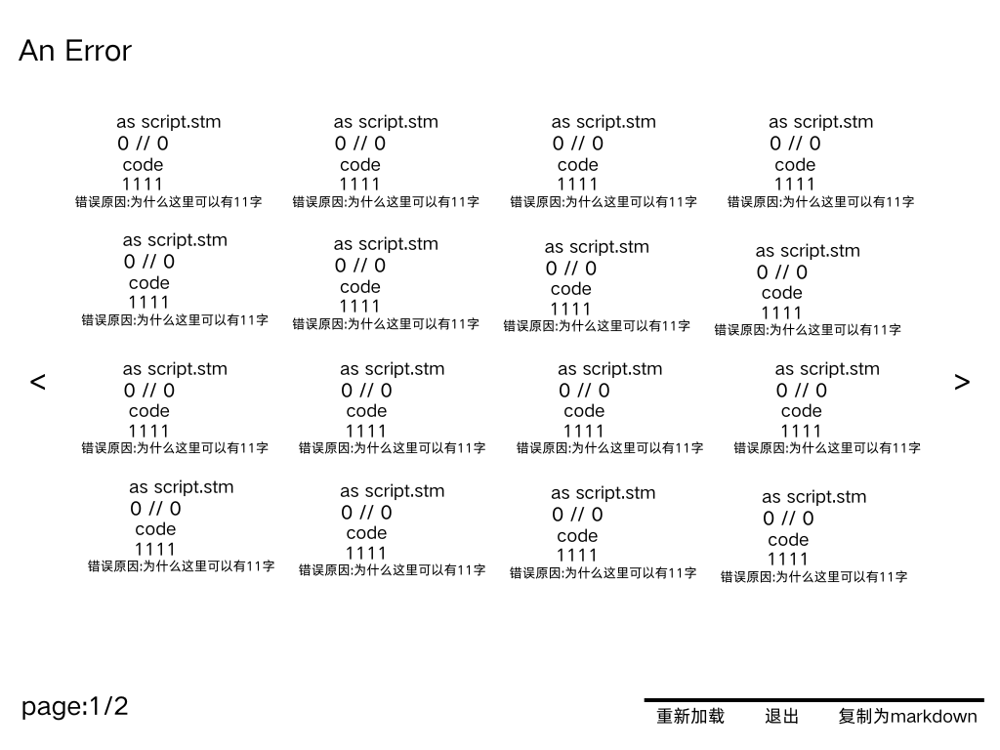

# STMG 超级文本 Markdown：给 Galgame 写剧本的一门语言

STMG（**S**uper **T**ext **M**arkdown **G**algame language），中文叫「超级文本 Markdown 语言」，简称 **STM / STMG**。它是一门专门用来写 Galgame 剧本的标记语言，设计思路非常直白：

- 像 HTML 一样，文档分成「**头**」和「**身体**」两块；
- 像 Markdown 一样，剧本本身保持接近纯文本的可读性，把 md 的特性直接搬进 Galgame 里。

下面就从头写到尾，把语法、目录组织、角色定义、扩展接口和错误提示机制完整过一遍。

## 一、整体结构：头 + 身体

和 HTML 一样，一份 STM 文档分成头和身体两部分。

### 头（head）

头负责描述游戏的元信息：

```
<
Large=800x600
title="title"
Ver="1.0.0"
Pack="com.example.example"
Lang="cn"
Font="SIMHEI"
>
```

| 字段 | 示例值 | 含义 |
| --- | --- | --- |
| `Large` | `800x600` | 游戏窗口分辨率 |
| `title` | `title` | 游戏标题 |
| `Ver` | `1.0.0` | 版本号 |
| `Pack` | `com.example.example` | 包名 |
| `Lang` | `cn` | 语言 |
| `Font` | `SIMHEI` | 默认字体 |

### 身体（body）

身体就是剧本本身，用各种模块把剧情推下去：

```
<
Start:
"example"
"example"
<-- 我是注释 -->
Choose:
<-- 选择 -->
"选项1":"选项2"
If "选项1":
"example"
If "选项2":
"example"
"example"
Question:<-- 询问,input() -->
"example"
STM.Q = "text..."
<-- 这里是询问框中显示的文字 -->
"example"
"..."
"hello"
S.voice("music/1.aac/wav/mp3/...")
S.play("music/imamusicorbgm.MP3/wav")
S.sound("music/imabgs.mp3/wav")
"sth.."
S.cg("png/这里是背景/cg.png")
S.picture("png/在背景上层显示一张图片.png")
S.character("png/我是立绘.png")
>
```

从这段里能读出几个基本模块：

- **注释**：`<-- 我是注释 -->`
- **选择**：`Choose:` 后面接 `"选项1":"选项2"`，再用 `If "选项1":` / `If "选项2":` 分别接住两条分支
- **询问**：`Question:` 配合 `STM.Q` 拿到玩家的输入，其中 `STM.Q = "text..."` 是询问框里显示的文字
- **音频**：`S.voice()` 语音、`S.play()` 音乐 / BGM、`S.sound()` 背景音效，括号里直接写资源路径，`aac / wav / mp3` 都支持
- **画面**：`S.cg()` 背景 CG、`S.picture()` 在背景上层叠一张图、`S.character()` 立绘
- **说话**：直接用 `"..."` 引起来就是一句台词

### 结尾（可选）

剧本末尾可以带一段可选的结尾：

```
<
"hi"
>
```

再往后还可以单独放一段收尾：

```
<
"感谢游玩"
>
```

## 二、Markdown 支持

STM 把 Markdown 的行内特性直接搬了进来，比如加粗：

```
"**hello**"加粗
```

这就是它最核心的主张——**把 md 的特性加入到制作 Galgame 中**。

## 三、完整示例：script.stm

把上面的东西拼起来，一份完整的 `script.stm` 长这样：

```
<
Large=800x600
title="title"
Ver="1.0.0"
Pack="com.example.example"
Lang="cn"
Font="SIMHEI"
>
<
Start:
"example"
"example"
<-- 我是注释 -->
Choose:
<-- 选择 -->
"选项1":"选项2"
If "选项1":
"example"
If"选项2":
"example"
"example"
Question:<-- 询问,input() -->
"example"
STM.Q = "text..."
<-- 这里是询问框中显示的文字 -->
"example"
"..."
"hello"
S.voice("music/1.aac/wav/mp3/...")
S.play("music/imamusicorbgm.MP3/wav")
S.sound("music/imabgs.mp3/wav")
"sth.."
S.cg("png/这里是背景/cg.png")
S.picture("png/在背景上层显示一张图片.png")
S.character("png/我是立绘.png")
>
<
"感谢游玩"
>
```

## 四、调用 API：R.api

要联网调接口，用 `R.api()`：

```
R.api(url="example.com" key="可选,sk-1234567890")
```

`url` 是接口地址，`key` 是可选参数，不填也行。

## 五、变量

变量用 `SET` 声明：

```
SET 名称 = 内容
```

它也能直接吃文件后缀：

```
SET dec = dec.all(".stmdec")
```

`dec` 的完整用法以后再讲。

## 六、设置界面：Options.stm

游戏的配置单独放在 `Options.stm` 里：

```
<
About = "这里是显示在about中的内容,你可以随便写,也可以在gui.py中隐藏about按钮,123456789"
Enc  = "这里是密钥,解密时没有你的密钥解不开(除非那个解包的一直暴力破解)"
dec = "*.stm,*.png,*.txt"
<-- 如果你担心在script中写apikey有风险,可以在这里写
只需要你在R那里,把key写成"option"
R.api(url="example.com" key=option)
-->
Key = "132456789"
>
```

这里的思路是：把 apikey 藏进 `Options.stm` 的 `Key`，剧本里只写 `key="option"` 去引用它——这样明文密钥就不会出现在 `script.stm` 里了。

## 七、目录结构

### 开发时

开发目录放在用户指定的文件夹里，这里假设是 `C:/111`：

```
📂111
├── 📂你游戏的名称 (游戏数据目录)
├── 📄script.stm (主剧本文件)
├── 📄options.stm (游戏配置文件，如分辨率、音量等)
├── 📂music (音频素材)
│   └── 📄yourmusic.mp3
├── 📂gui (UI界面素材与逻辑)
│   ├── 📂textbox (文本框素材)
│   │   └── 📄box.png (文本框背景图)
│   ├── 📂button (按钮素材)
│   │   ├── 📄start.png (开始按钮)
│   │   ├── 📄setting.png (设置按钮)
│   │   ├── 📄about.png (关于按钮)
│   │   ├── 📄button.png (通用按钮背景)
│   │   └── 📄voice.png (语音/音量按钮)
│   └── 📂png (用户自定义图片)
│       └── 📄用户自定义的.png
├── 📄markdown.py (md渲染模块，负责解析剧本语法)
├── 📄gui.py (固定GUI大小、位置、坐标、可见性、按钮数量等)
└── 📄start.exe (开发调试启动器)
```

> ⚠️ **注意**：每次修改剧本后打开它查看效果。完事后，不要直接发布这个！
> 正确做法是：在引擎中选择「发布」选项，生成加密的发布版。

### 发布版

发布版同样放在用户指定的文件夹里，这里假设是 `C:/1111`，原本的 `.stm` 全部变成加密后的 `.stmdec`：

```
📂1111
|__📂你游戏的名称
    |__📄script.stmdec
    |__📄options.stmdec
    |__📄music.stmdec
    |__📄gui.stmdec
    |__📄markdown.stmdec
    |__📄guipy.stmdec
|__📄start.exe(这是主文件)
```

### 引擎自带的 STMENC

STMG 引擎底下还有一个 `STMENC` 文件夹：

```
📂STMENC
|__📄start.py
```

没了。

## 八、定义角色

在 `Start:` 里用 `S.character()` 注册角色，之后角色名直接接台词：

```
Start:
S.character("名称")
名称"说的话"
```

要一次定义多个角色，就多写几行：

```
Start:
S.character("名称2")
S.character("名称1")
名称2"say"
名称1"say"
```

## 九、后门：STM.python()

因为底层是 Python，STMG 留了个后门，让开发者可以装 Python 库、直接在剧本里调用：

```
STM.python("name")
```

`name` 就是你要用的模块名，比如：

```
STM.python("turtle")
Turtle.forward(10)
```

这会打开一个窗口，让乌龟前进 10。

不过，有些开发者可能会用这个能力窃取隐私，所以**它会在右上角显示自己干了什么**：

```
[turtle"forward"]
```

> 如果你是想做 DDLC 那种悄无声息获取用户名的效果，建议你不要用这个，会打破沉浸感。

## 十、Display：右上角提示框

`STM.display()` 会在右上角弹一个框，和 `STM.python` 那个类似：

```
STM.display("example")
```

框里会显示 `[example]`。比如资源加载成功的时候，可以提示一句：

```
STM.display("资源加载成功了喵")
```

## 十一、ERROR 屏幕

和 Ren'Py 一样，也和所有语言一样——出错总要给个提示。**Error 只会在开发环境中显示**，不会跑到玩家面前。

触发 error 的方式有很多：

```
未定义角色就直接让角色说话
开头结尾忘记"<>"
把gui写错了
错误的运算(÷0/tan(90)/....)
....
```

错误界面长这样，会把所有报错分页列出来：



每条错误会告诉你出错的文件（`as script.stm`）、位置（`0 // 0`）、代码（`code`）、行号（`1111`）和错误原因，底部带上「重新加载 / 退出 / 复制为 markdown」三个按钮，左下角有 `page:1/2` 翻页。

### 错误有 5 个等级

按报错数量，错误被分成了五档：

| 等级 | 触发条件 |
| --- | --- |
| `A error` | 只有一个错误 |
| `An error` | 1 个以上，40 以下 |
| `Many error` | 40 以上，50 以下 |
| `Lot of error` | 50 以上，100 以下 |
| `Bro....` | 100 以上 |

## 小结

STMG 想做的事情其实很简单：**把 HTML 的分区思路和 Markdown 的写作手感，塞进 Galgame 的剧本里**。头写元信息，身体写剧情，`S.*` 管音频和画面，`STM.*` 管扩展，配置和剧本分开存放，出错有分级提示——一套下来，写剧本这件事就回到了「写字」本身。

后续会继续补 `dec.all()` 的用法和发布加密那一块，到时候再写一篇。
